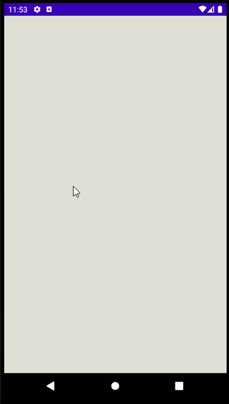

# Project 1 - *Simple Todo*

**Simple Todo** is an android app that allows building a todo list and basic todo items management functionality including adding new items, editing and deleting an existing item.

Submitted by: **AkiahTullis**

Time spent: **16** hours spent in total

## User Stories

The following **required** functionality is completed:

* [x] User can **view a list of todo items**
* [x] User can **successfully add and remove items** from the todo list
* [x] User's **list of items persisted** upon modification and and retrieved properly on app restart

The following **optional** features are implemented:

* [x] User can **tap a todo item in the list and bring up an edit screen for the todo item** and then have any changes to the text reflected in the todo list

The following **additional** features are implemented:

* [x] User can **label todo items as important**
* [x] User can seperate todo items into **tasks, events, and notes**
* [x] User has access **two seperate lists**: a backlog and a 'today' page
* [x] User can **move tasks between the two pages** by swiping

## Video Walkthrough

Here's a walkthrough of implemented user stories:

GIF created with [LiceCap](http://www.cockos.com/licecap/).

## Notes

Had some difficulty with FileUtils.readlines -- it was not being recognized. I solved this issue by folowing the advice in a youtube comment under *SimpleTodo: Episode 4*. I replaced "import android.os.FileUtils;" with "import org.apache.commons.io.FileUtils;", as suggested.

Figuring out the ItemTouchHelper took longer than anticipated. Animation was similarly unintuitive. There is a shameful amount of code duplication at present, so I'll have to go back and refactor that. I had to do a lot of reading today to understand some of these topics enough to do what I wanted with them.

## License

    Copyright [2020] [akiah tullis]

    Licensed under the Apache License, Version 2.0 (the "License");
    you may not use this file except in compliance with the License.
    You may obtain a copy of the License at

        http://www.apache.org/licenses/LICENSE-2.0

    Unless required by applicable law or agreed to in writing, software
    distributed under the License is distributed on an "AS IS" BASIS,
    WITHOUT WARRANTIES OR CONDITIONS OF ANY KIND, either express or implied.
    See the License for the specific language governing permissions and
    limitations under the License.
